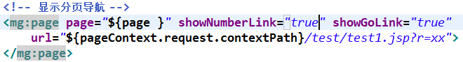

#mgpage 
---
1/5/2015 11:20:29 PM 

MgPage简要分析： 
1.分页数据显示 + 分页导航显示 
数据显示：c:foreach标签完成； 
分页导航：自定义标签mg:page完成。  
2.分页导航分割： 
①首页 上一页 下一页 尾页 （默认开启） 
②数字链接 （选择开启） 
③跳转到表单 （选择开启） 
④分页信息显示部分 (选择开启) 
 
不选择开启（只开启默认的）： 

  
选择开启数字链接： 

  
开启跳转到链接： 

  
全部开启： 
 

新增分页信息部分： 

  
3.结合freemarker测试的时候，出现了参数不匹配的错误，暂时还没有找出来。不过，已经发现了，我自己写的这个自定义分页标签有很多局限的地方。
